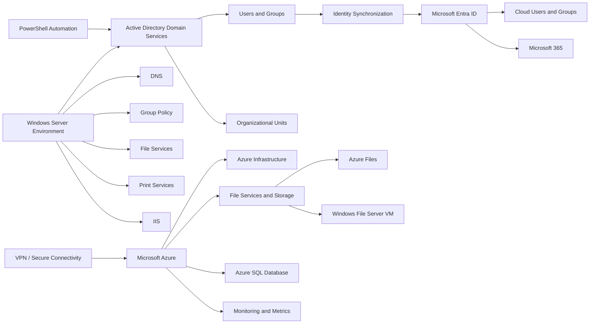
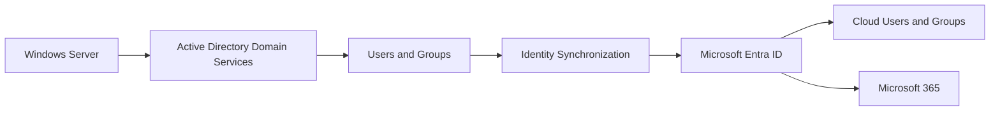
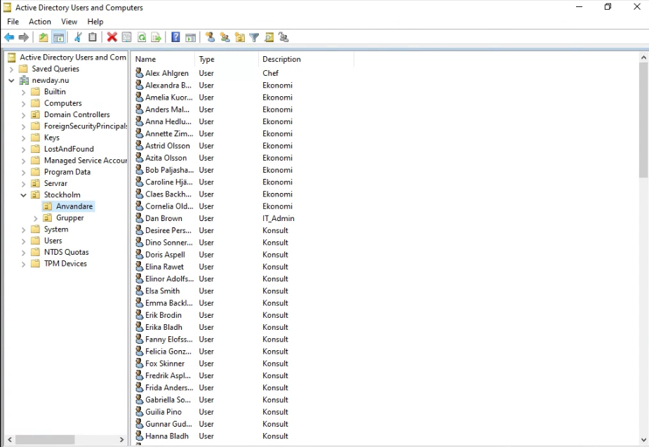
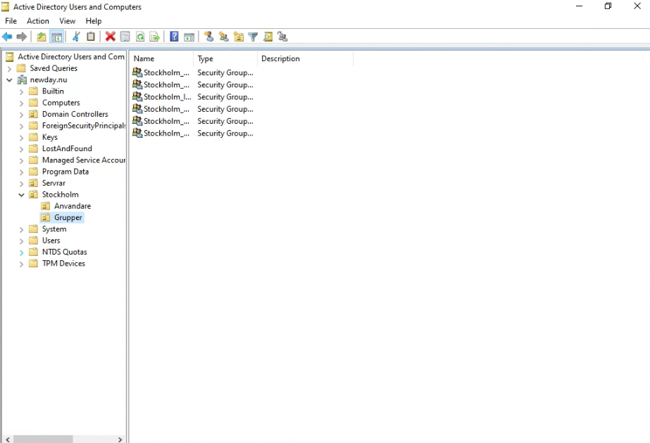
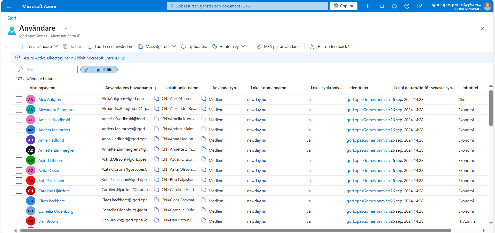
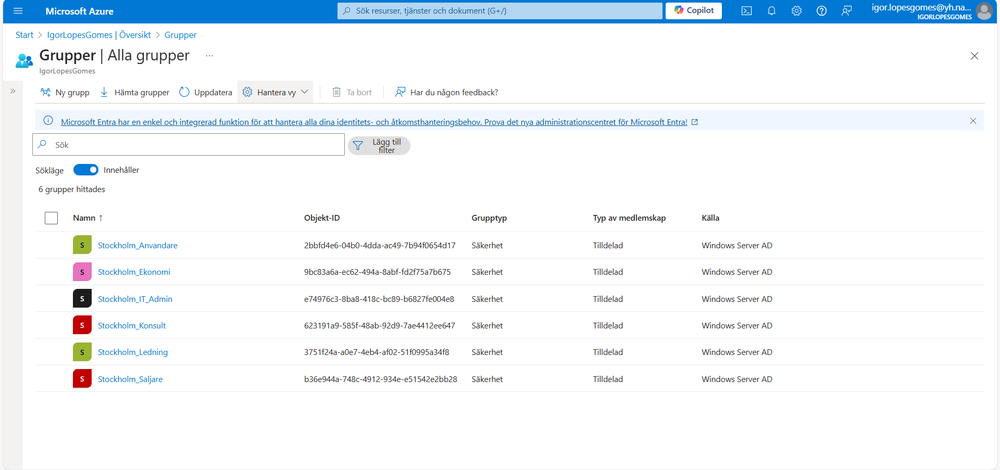
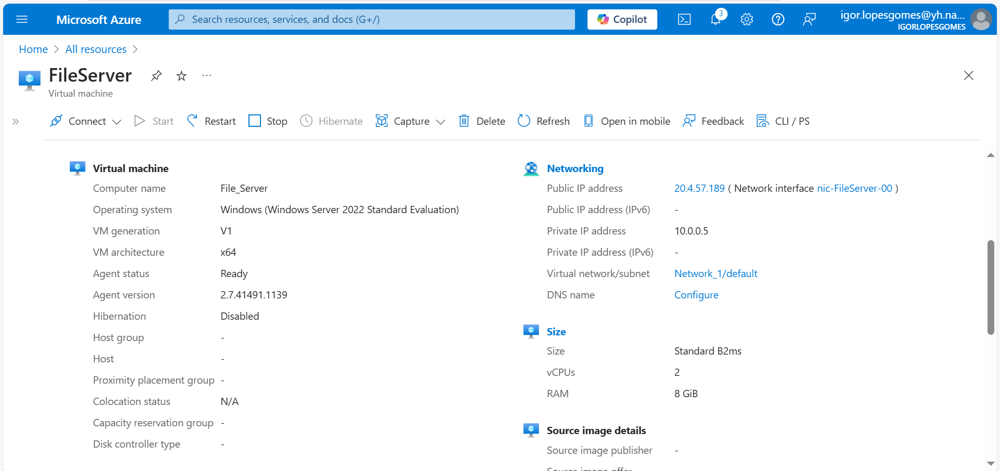
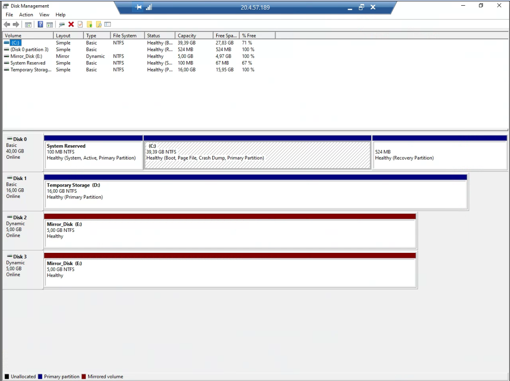
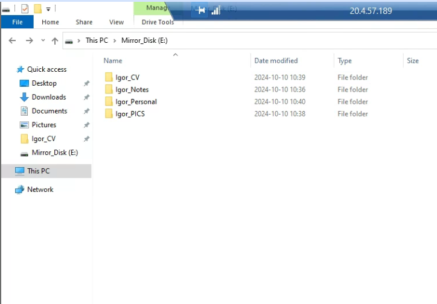

# Windows Server & Azure Hybrid Infrastructure

> By Igor Gomes

A DevOps-focused academic infrastructure project combining Windows Server administration, Active Directory, PowerShell automation, Microsoft Azure, Microsoft Entra ID and hybrid identity integration.

The project started with a domain-based on-premises Windows Server environment and was later extended into Microsoft cloud services through synchronized identities, secure connectivity, cloud infrastructure and Microsoft 365.

This repository presents selected technical implementation, documentation and evidence from the completed lab environment.

---

## Overview

### What

> A Windows Server and Azure hybrid infrastructure project covering centralized identity management, access control, infrastructure administration, automation, hybrid identity and Microsoft cloud services.

### Why

> Built to develop practical experience administering enterprise Windows environments and extending traditional on-premises infrastructure into Microsoft Azure and Microsoft Entra ID.

### Value

> The project demonstrates how Windows Server administration, Active Directory, PowerShell automation and Microsoft cloud services can work together as part of a hybrid infrastructure environment.

### Scope

> This is an academic infrastructure project completed during my DevOps Engineer studies at Nackademin. The repository focuses on selected technical implementation and evidence from the completed lab environment rather than reproducing the complete course material.

---

## Infrastructure Overview

The environment was built around an on-premises Windows Server domain and later extended into Microsoft Azure.

Active Directory provided centralized identity and access management on-premises. Users and groups were synchronized to Microsoft Entra ID, extending the identity structure into the Microsoft cloud environment.



Detailed architecture views:

- [On-Premises Architecture](diagrams/on-premises-architecture.md)
- [Hybrid Identity Flow](diagrams/hybrid-identity-flow.md)

---

## Windows Server Infrastructure

The on-premises environment was built using Windows Server 2022 and Active Directory Domain Services as the foundation for centralized identity and infrastructure administration.

The implementation included:

- Active Directory Domain Services
- domain-integrated DNS
- Organizational Units
- users and security groups
- role-based resource access
- Group Policy
- password policies and account lockout configuration
- Windows File Services
- shared folders and NTFS permissions
- folder redirection
- Print Services
- IIS
- server and storage administration

Users and resources were structured around organizational roles rather than managed individually, allowing permissions and policies to be applied through groups and centralized administration.

The original project documentation contains the detailed server configuration and implementation evidence.

[View Windows Server Documentation](docs/windows-server-documentation.pdf)

---

## Identity and Access Management

Active Directory was used as the central identity system for the on-premises environment.

Organizational Units and security groups were used to structure users and control access to resources. Group-based permissions were applied to shared resources, while password and account policies provided differentiated security configuration for selected administrative roles.

This demonstrates practical use of centralized identity, group-based authorization and policy-driven administration within a Windows domain.

---

## PowerShell Automation

PowerShell was used to automate repetitive Active Directory administration.

The project included automated user creation from structured employee data. The published portfolio version demonstrates:

- CSV-based user import
- automatic `SAMAccountName` generation
- Swedish character normalization
- User Principal Name generation
- configurable target Organizational Units
- existing-account validation
- Active Directory account creation
- secure password input
- required password change at first logon

The repository contains a sanitized version of the automation together with fictitious example input data.

[View Active Directory User Import](powershell/README.md)

---

## Hybrid Identity and Microsoft Azure

The on-premises Active Directory environment was extended into Microsoft Azure through a hybrid identity scenario.

Users and groups managed in the local domain were synchronized to Microsoft Entra ID, allowing the identity structure to be represented in the Microsoft cloud environment.

The cloud work included practical experience with:

- Microsoft Entra ID
- synchronized users and groups
- Azure tenant administration
- Microsoft 365 and Outlook
- Azure tenant administration
- Azure virtual infrastructure
- Azure Files
- Windows File Server hosted in an Azure virtual machine
- Windows Server storage administration and mirrored storage
- Azure SQL Database
- VPN and secure connectivity
- resource monitoring and metrics
- IaaS and PaaS concepts
- migration considerations for on-premises workloads

This connected traditional Windows Server administration with cloud identity, infrastructure, platform services and operational administration.

For the detailed cloud implementation overview:

[Azure and Microsoft Entra ID Integration](docs/azure-integration.md)

---

## Hybrid Identity Flow



The corresponding identities visible in both Active Directory and Microsoft Entra ID provide evidence of the hybrid identity implementation.

---

## Technical Evidence

Selected screenshots from the completed lab environment are included as technical evidence.

### Active Directory





### Microsoft Entra ID and Hybrid Identity

The Microsoft Entra ID evidence demonstrates identities synchronized from the on-premises Active Directory environment.

The user view shows synchronized accounts originating from the local domain, while the group view identifies Windows Server AD as the source of the synchronized security groups.

Together with the corresponding on-premises Active Directory evidence, these screenshots demonstrate the hybrid identity implementation.





### Azure File Services and Storage

The following evidence demonstrates a Windows Server 2022 File Server hosted in Azure together with its storage configuration and mirrored volume.







---

## Tech Stack

| Technology | Purpose |
| --- | --- |
| Windows Server 2022 | Server and domain infrastructure |
| Active Directory Domain Services | Centralized identity and domain management |
| Microsoft Azure | Cloud infrastructure and platform services |
| Azure Virtual Machines | Cloud-hosted Windows Server infrastructure |
| Microsoft Entra ID | Cloud identity and hybrid identity management |
| Microsoft 365 | Microsoft cloud services and Outlook environment |
| PowerShell | Infrastructure and account automation |
| Group Policy | Centralized domain configuration |
| DNS | Domain name resolution |
| NTFS | File-system permissions and mirrored storage |
| Windows File Services | Shared resources and Windows-based file server infrastructure |
| Azure Files | Managed cloud file services |
| Azure SQL Database | Managed cloud database service |
| VPN | Secure hybrid connectivity |
| IIS | Windows web services |

---

## Security and Publication

The project was developed in an academic lab environment using fictitious organizational data.

The public repository excludes credentials, passwords and unnecessary environment-specific identifiers. Published automation and screenshots are selected or sanitized where appropriate while preserving the technical implementation demonstrated by the original project.

The original Windows Server documentation is retained as historical technical evidence from the completed lab environment.

---

## Repository Structure

```text
windows-server-azure-hybrid-infrastructure/
├── README.md
│
├── diagrams/
│   ├── on-premises-architecture.md
│   └── hybrid-identity-flow.md
│
├── powershell/
│   ├── README.md
│   ├── import-ad-users.ps1
│   └── employees.example.csv
│
├── evidence/
│   ├── active-directory/
│   │   ├── users.png
│   │   └── groups.png
│   │
│   ├── azure-entra-id/
│   │   ├── users.png
│   │   └── groups.png
│   │
│   └── file-services/
│       ├── azure-fileserver-vm.png
│       ├── mirrored-storage.png
│       └── fileserver-storage.png
│
└── docs/
    ├── windows-server-documentation.pdf
    └── azure-integration.md
```

---

## Contact

Igor Gomes · DevOps Engineer

**Email:** [igor.gomes.u@gmail.com](mailto:igor.gomes.u@gmail.com)  
**LinkedIn:** [Igor Gomes](https://www.linkedin.com/in/igor-gomes-5b6184290/)  
**GitHub:** [igor-gomes-u](https://github.com/igor-gomes-u)