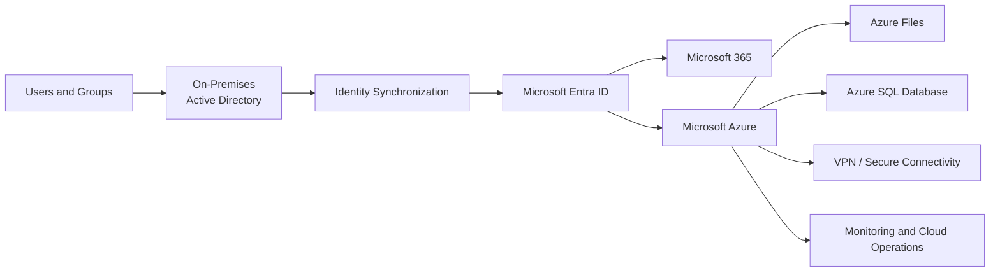

# Hybrid Identity Flow

## Architecture Concept

The cloud portion of the academic environment extended the existing Windows Server identity structure into Microsoft Entra ID and the broader Microsoft cloud ecosystem.

Users and groups from the on-premises Active Directory environment were synchronized to Microsoft Entra ID, demonstrating a hybrid identity model where identities managed in the local domain could also participate in cloud-based services.

Microsoft Entra ID provided the cloud identity layer for access to Microsoft cloud services, including Microsoft 365 and Azure resources.

The Azure environment included practical work with file services, Azure SQL Database, secure VPN connectivity, resource monitoring, cloud operations and cost awareness.

This diagram represents the architectural relationship between the technologies and concepts implemented during the academic lab. It is intentionally simplified and does not represent a production topology or expose tenant-specific configuration.