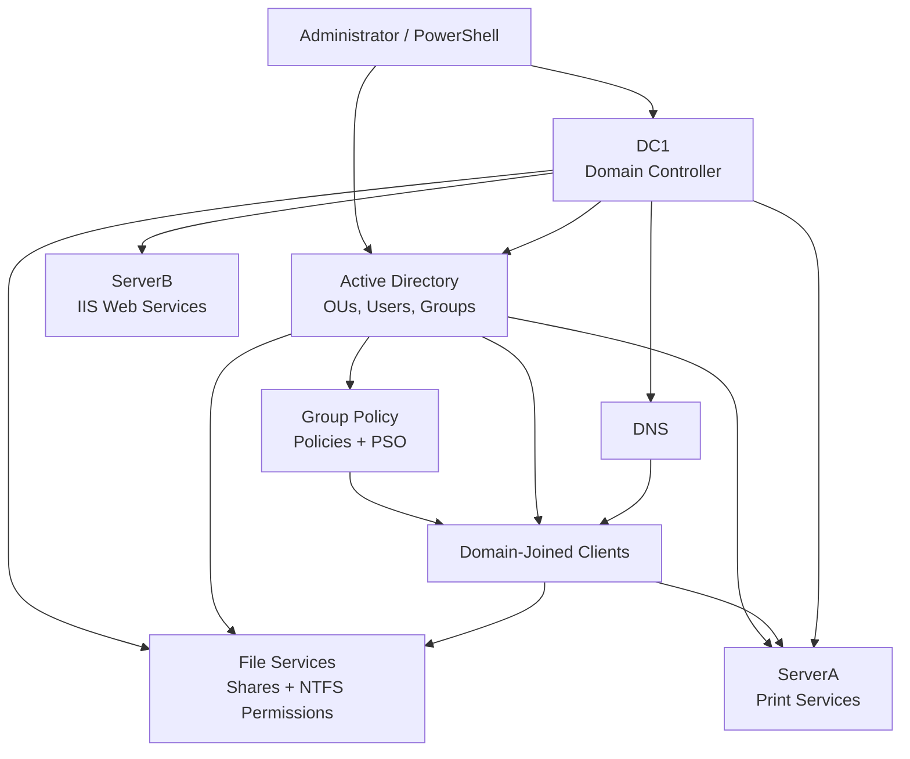

# On-Premises Architecture

## Design Focus

The on-premises lab was designed as a domain-based Windows Server environment with centralized identity, policy and resource administration.

The infrastructure separated core responsibilities across a domain controller, print server and web server. Active Directory Domain Services provided centralized users, Organizational Units and security groups, while DNS supported domain name resolution.

Group Policy was used for centralized configuration, together with password policies and Fine-Grained Password Policy through Password Settings Objects (PSO).

File services included shared folders, drive mappings, folder redirection and role-based access using security groups and NTFS permissions. Print Services provided centrally managed printing, while IIS provided Windows-based web services.

PowerShell was used to automate repetitive Active Directory administration, including importing structured user data and creating accounts consistently.