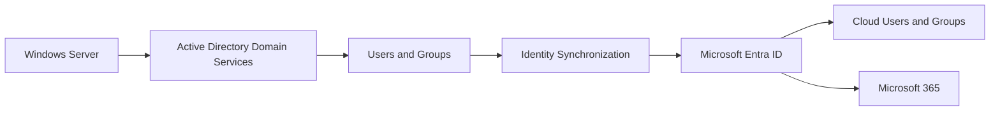

# Azure and Microsoft Entra ID Integration

## Scope

The cloud portion of the project extended the on-premises Windows Server environment into Microsoft Azure and the broader Microsoft cloud ecosystem.

The work connected traditional Active Directory administration with Microsoft Entra ID, hybrid identity, secure connectivity, cloud infrastructure, storage, database services, monitoring and Microsoft 365.

The environment was implemented as an academic lab during the DevOps Engineer programme at Nackademin.

---

## Hybrid Identity

A central part of the cloud environment was extending the existing Active Directory identity structure into Microsoft Entra ID.

Users and groups from the on-premises Active Directory environment were synchronized to Microsoft Entra ID, allowing identities created and managed in the local domain to also be represented in the Microsoft cloud environment.

Selected repository evidence demonstrates corresponding identities in both environments.



This provided practical experience with hybrid identity administration rather than maintaining completely independent local and cloud identity structures.

---

## Microsoft Entra ID

Microsoft Entra ID was used as the cloud identity platform.

The environment included:

- synchronized users
- synchronized groups
- cloud identity administration
- identity and access management concepts
- integration with the broader Microsoft cloud environment

The synchronized identities demonstrate the relationship between the local Windows Server domain and the Microsoft cloud identity environment.

---

## Microsoft 365

The coursework also included practical use of Microsoft 365 and Outlook.

This extended the identity work beyond infrastructure administration and demonstrated how Microsoft cloud identities can be used across cloud-based services.

Microsoft 365 is therefore presented as part of the broader cloud environment, while the repository's hybrid identity evidence focuses specifically on the relationship between Active Directory and Microsoft Entra ID.

---

## Azure Infrastructure

The Azure portion of the project included practical work with cloud resources and administration.

The work covered:

- Azure tenant administration
- virtual infrastructure
- storage and file services
- Azure SQL Database
- networking concepts
- secure VPN connectivity
- resource administration
- monitoring and metrics
- IaaS and PaaS concepts
- migration considerations for on-premises workloads

These activities provided practical exposure to extending traditional infrastructure administration into a cloud environment.

---

## VPN and Secure Connectivity

Secure connectivity formed part of the Azure and hybrid infrastructure work.

VPN concepts were used to work with secure access between infrastructure environments and to understand how on-premises resources can interact with cloud-based infrastructure.

This complemented the identity work by introducing the networking and connectivity requirements of hybrid environments.

---

## File Services and Storage

The Azure environment included practical work with both Azure-native file services and Windows Server-based file infrastructure hosted in Azure.

Azure Files was used to work with cloud-based file shares, including access to file storage from the local environment.

The project also included a Windows Server 2022 virtual machine configured as a file server in Azure. Storage administration within the server included a mirrored NTFS volume used for file storage, providing practical experience with Windows Server storage management in a cloud-hosted infrastructure.

Together, these exercises demonstrated two different approaches to file services in Azure:

- Azure Files as a managed cloud file service
- Windows Server File Services running on Azure virtual infrastructure
- Azure-hosted storage and Windows disk administration
- mirrored storage for file availability
- access to cloud-based file resources from the local environment

Selected repository evidence demonstrates the Azure-hosted Windows Server VM, its mirrored storage configuration and the file structure stored on the mirrored volume.

---

## Azure SQL Database

Azure SQL Database was used during the cloud coursework as part of practical exposure to Azure platform services.

This introduced managed database concepts and provided experience with database capabilities delivered as a cloud platform service rather than through direct administration of the underlying server infrastructure.

Azure SQL Database was part of the broader Azure learning environment and was not a central component of the hybrid identity architecture.

---

## Monitoring and Cloud Operations

The Azure environment also included operational administration, monitoring and cost management concepts.

The work covered:

- Azure resource monitoring
- CPU metrics
- infrastructure metrics
- resource administration
- service health considerations
- cloud workload management
- cost monitoring and resource consumption
- cost awareness when provisioning and operating cloud resources

This provided practical exposure to the operational and financial aspects of cloud infrastructure in addition to resource provisioning.

---

## Relationship to the On-Premises Environment

The complete project can be viewed as two connected infrastructure areas:

```text
On-Premises
    │
    ├── Windows Server
    ├── Active Directory
    ├── DNS
    ├── Group Policy
    ├── File Services
    ├── IIS
    └── PowerShell
            │
            ▼
     Hybrid Identity
            │
            ▼
Microsoft Cloud
    │
    ├── Microsoft Entra ID
    ├── Microsoft 365
    ├── Azure Infrastructure
    ├── Azure Files
    ├── Azure SQL Database
    ├── VPN / Connectivity
    └── Monitoring
```

The project therefore demonstrates progression from traditional Windows Server administration toward hybrid and cloud infrastructure concepts.

---

## Technical Evidence

Selected screenshots in the repository provide evidence of the implemented environment, including:

- on-premises Active Directory users and groups
- synchronized identities in Microsoft Entra ID
- Microsoft Entra ID users and groups
- Windows Server 2022 File Server hosted in an Azure virtual machine
- mirrored NTFS storage configured on the Azure-hosted File Server
- file storage using the configured mirrored volume