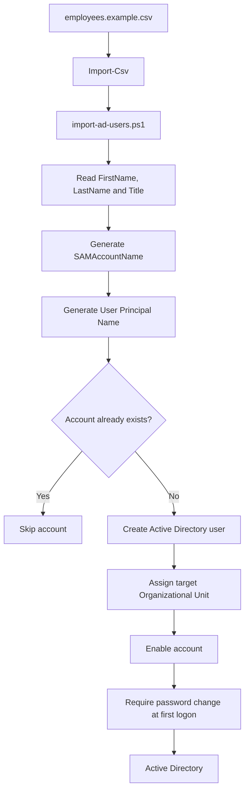

# Active Directory User Import

This directory contains a PowerShell automation example for creating Active Directory users from CSV data.

## Flow



## Files

`import-ad-users.ps1` imports user data, generates account identifiers, checks for existing accounts and creates new Active Directory users.

`employees.example.csv` provides fictitious example data matching the input format expected by the script.

## Usage

```powershell
$password = Read-Host "Enter temporary password" -AsSecureString

.\import-ad-users.ps1 `
    -CsvPath ".\employees.example.csv" `
    -DefaultPassword $password
```

The target Organizational Unit and UPN suffix can be overridden through the script parameters.